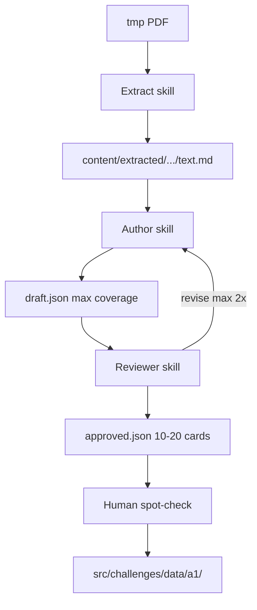

# Challenge ingestion from PDFs

Pipeline to turn A1 textbook PDFs in `tmp/` into TabTaal challenge JSON.

**Not in git:** PDFs (`tmp/`), working artifacts (`content/`), ingestion scripts. Agents create ephemeral scripts at runtime and write outputs locally. Only production challenge JSON (`src/challenges/data/`) and `manifest.json` get committed.

## Sources

| Slug              | PDF                             | Level | Topic prefix |
| ----------------- | ------------------------------- | ----- | ------------ |
| `het-fundament`   | `tmp/Het-Fundament-c2025QR.pdf` | a1    | `fundament`  |
| `kom-maar-binnen` | `tmp/Kom-maar-binnen_2025.pdf`  | a1    | `kmb`        |

Agents maintain a local `content/sources.json` with chapter index and status (`extracted` | `drafted` | `approved` | `merged`).

## Pipeline



Use Cursor skills: `pdf-extract`, `challenge-author`, `challenge-reviewer`.

## Stage 1 — Extract

```
Extract het-fundament from tmp/Het-Fundament-c2025QR.pdf
```

1. Confirm PDF exists in `tmp/`.
2. Scan TOC — list chapters with page ranges.
3. Create or update `content/sources.json` → `chapters[]` with `id`, `title`, `pages`, `status`.
4. For each chapter: transcribe text (PyMuPDF if selectable, vision if scanned).
5. Write `content/extracted/{slug}/chpt-NN/text.md` and optional `pages.json`.

Write a one-off extraction script if batching helps; do not commit it.

## Stage 2 — Author

```
Author challenges for het-fundament chpt-01
```

1. Read `content/extracted/{slug}/chpt-NN/text.md`.
2. Read gold examples from `src/challenges/data/a1/*.json`.
3. Generate **all valid challenges** — do not self-limit count.
4. Write `content/staging/{slug}/chpt-NN.draft.json` (JSON array only).
5. Validate against [challenge-data.md](./challenge-data.md) schema.

**ID format:** `a1.{topicPrefix}-chpt{NN}.{slug}.{type}` (e.g. `a1.fundament-chpt01.fiets.de_het`).

**Implemented types only:** `de_het`, `nl_to_en`, `en_to_nl`, `nl_to_en_sentence`, `en_to_nl_sentence`, `read_mcq`, `knm`, `dialogue_reply`, `fill_blank`, `verb_form`, `preposition`, `number_detail`, `read_order`, `read_match`, `word_order`.

## Stage 3 — Review

```
Review challenges for het-fundament chpt-01
```

1. Load draft from `content/staging/{slug}/chpt-NN.draft.json`.
2. Check ID collisions against `src/challenges/data/a1/`.
3. Curate to **10–20 best cards** (all cards if draft &lt; 10).
4. Write `chpt-NN.review.json` (verdict, kept/dropped) and `chpt-NN.approved.json`.
5. If revise needed: max **2** author ↔ reviewer loops.

**Selection priority:** core vocab + `de_het` → situational (`read_mcq` / `knm`) → grammar → interactive → best remaining.

## Merge to production (manual)

1. Spot-check cards in Chrome (⌘D debug panel).
2. Copy approved cards to `src/challenges/data/a1/{topicPrefix}-chpt-NN.json`.
3. Add entry to `src/challenges/manifest.json`.
4. Verify:

```bash
npm run validate:challenges && ./build.sh
```

5. Commit only `src/challenges/data/a1/` and `manifest.json` — never `content/` or ingestion scripts.

## Pilot order

1. `het-fundament` chpt-01 (end-to-end, tune workflow)
2. Remaining Fundament chapters
3. `kom-maar-binnen` chapters (KNM / society focus)

## Related docs

- [challenge-data.md](./challenge-data.md) — production JSON format
- [AGENTS.md](../AGENTS.md) — app architecture
